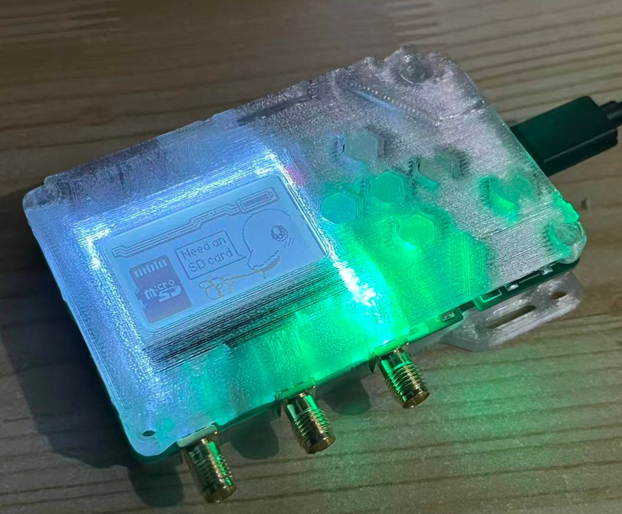
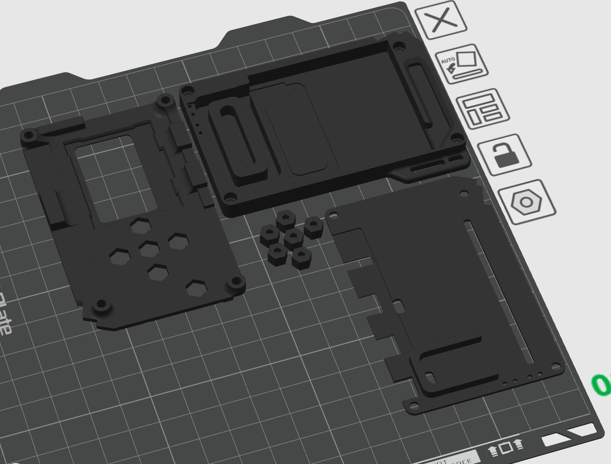
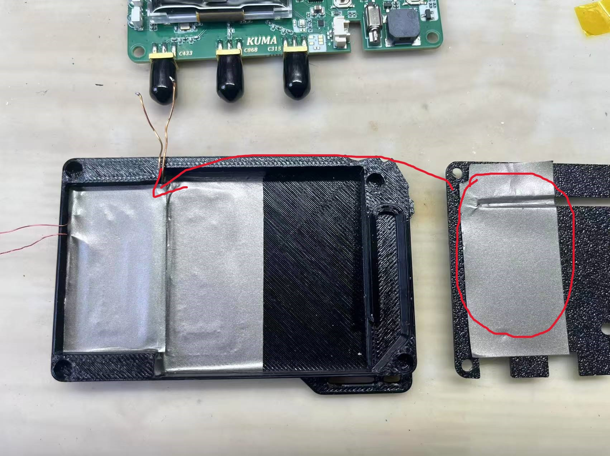

欢迎来到这里，感谢大家支持，如果你有一台3D打印机，现在你可以为自己打印更漂亮⭐更具个人特色😎的外壳!并且如果你有足够的时间，可以选择更精细的打印精度。

我在打印时使用了PETG材料，如果打印机设置正确的话，打印效果还不错。

> [!WARNING]
> 警告，拆卸壳体有可能损坏设备，你需要自己承担后果。

> [!IMPORTANT]
> 声明：如果你喜欢FlipperZero项目，并且拥有足够的经济能力，可以通过官方渠道购买原版设备，构建如此强大的社区并不容易，感谢他们开源了大量资料。我的设备并不是为了伪造或者盗版，而是针对性进行了一些修改，且使用了全新的外观用于区分，与原版设备的外壳、结构零件等完全不兼容。目的是制作更廉价的设备，使项目得到更好的发展。

> [!IMPORTANT]
> 再次声明：设备仅用作专业人员的合法技术学习和合法分析测试（你最好知道你自己在干什么）。

### 开始打印自己的外壳前，你需要知道：
1、由于成本的压缩，以及有限的能力，结构上并不是那么完美，拆装有风险，请仔细阅读说明，并且确保你有一个电烙铁和灵活的双手。

2、更换和安装外壳需要一定的动手能力，开始之前确定你可以搞定，不要弄坏你的设备，因为拆卸导致的后果，由你自己承担。

3、确保3D打印机的打印板干净，富有粘性，因为打印一些窄线条和字符的时候，对打印板有较高的要求（我最初打印的时候因为打印板不够干净，粘性较差，失败了很多次）。

4、做好心理准备，由于是手工组装焊接的，所以内部会有焊接的痕迹~🙄

### 文件说明：目前最新版本[V1](./V1)

*这个目录包括5个零件：顶部壳体、中间层，底部壳体、按键、导光柱。*

> [!TIP]
> LED_Light_Pipe.step是设备正面的导光柱，需要使用透明耗材进行打印，如果没有可以空置，或者填充一些半透明的胶水。或者可以从现有的壳体上拆下来继续使用。

### 文件说明：[V1的透明版本](./V1_Transparent)

这是探索性质的透明版本外壳，如果你想要尝试透明效果，可以打印这个版本。
相比普通版本的模型，去除了单独的导光柱，并且将一整个按键模型修改为了6个独立的键帽，以减少遮挡。

*这个目录包括4个零件：顶部壳体、中间层，底部壳体、按键。*

> [!TIP]
> Botton_One.STEP是键帽，你需要打印6个。如果键帽有些松动，你需要额外使用一点点胶水来固定，但是一定小心不要让胶水流动到按键触点下面。

### 拆卸及组装说明：

> [!TIP]
> 拆卸之前，你可以触摸附近的接地金属，或者使用静电手环，避免静电损坏电路板。

**1、拆掉顶壳**

在设备正面，你可以看到边角处有4个螺丝，使用内六角螺丝刀拆下他们。

然后就会看到电路板。

**2、断开连接线**

使用镊子或者指甲，断开电路板右下方的电源连接插头。
> [!TIP]
> 如果你使用金属镊子，务必小心不要短路。

使用螺丝刀取下左上角的4颗小螺丝。

> [!TIP]
>为确保连接稳定，改为了焊接，如果你是在2026年5月份后得到的设备，是焊接方式的，你需要使用烙铁来拆除）。

**3、拿出主板**

将主板拿下来。这是主板背面的样子。

**4、取出线圈**

将中间层也拿下来，然后电池也可以拿出来。这一步你会注意到线圈的导线穿过了中间层零件左上角的4个小孔，靠上的是两根红色的线，靠下的是两根黄色的线，等下装回去时不要搞错。

> [!TIP]
> 由于RFID和NFC是交流信号，所以线圈本身的线序不区分正反，也就是说：只要保证上面的两个孔是红色的线就行。黄色的同理。

可以看到电池下方还有一片隔磁贴纸，使用镊子将其撕下来。

需要注意的是在我进行红色线圈固定时，为了避免晃动，在下方使用了一点点双面胶，只需要轻轻翘一下，就可以将线圈拆下来。

> [!TIP]
> 拆卸过程中，小心不要刮坏线圈表明的绝缘漆，可能会导致线圈之间异常短路，影响读写效果。

**5、回收螺母**

如果你没有热熔螺母，你可以将旧壳子上面的拆下来，你需要使用打火机或者电烙铁等工具进行局部加热，然后使用镊子将螺母翘出来。

如果你完成了上述步骤的话，恭喜你拆卸完成。

现在，把这些步骤再反向重复一遍，装回到新的壳体里。

**6、组装注意事项**

由于批次不同，底部壳体或许会有些不同，最新版本的底壳优化了零件的安装位置，RFID的模拟距离得到了提升，在安装线圈和隔磁贴纸时，需要注意，你需要将原本在图片右侧位置的贴纸移动到图片左侧的位置，并适当的进行一些裁剪。
另外由于位置的变化，RFID线圈（红色线圈）的导线长度会变短，你需要将导线拆下来一圈，这样才能焊接到PCB上（不用担心，缺少一圈对频率的影响不会很大）。

在连接线圈这一步，如果你有电烙铁，强烈建议使用电烙铁进行固定，更加可靠。如果没有的话，你可以继续使用螺丝，但是务必小心，不要把螺丝拧的太紧，如果100%是最紧，那么只需要拧到75%就可以了，不然很容易把导线挤压断裂（我弄坏过很多次~🙄）。

在最后一步时，顶部壳体这里会有一个凸台，刚好可以下压住这四个螺丝，避免螺丝晃动或者脱落。

